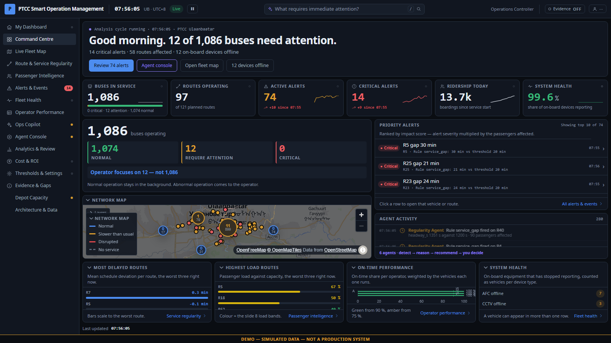
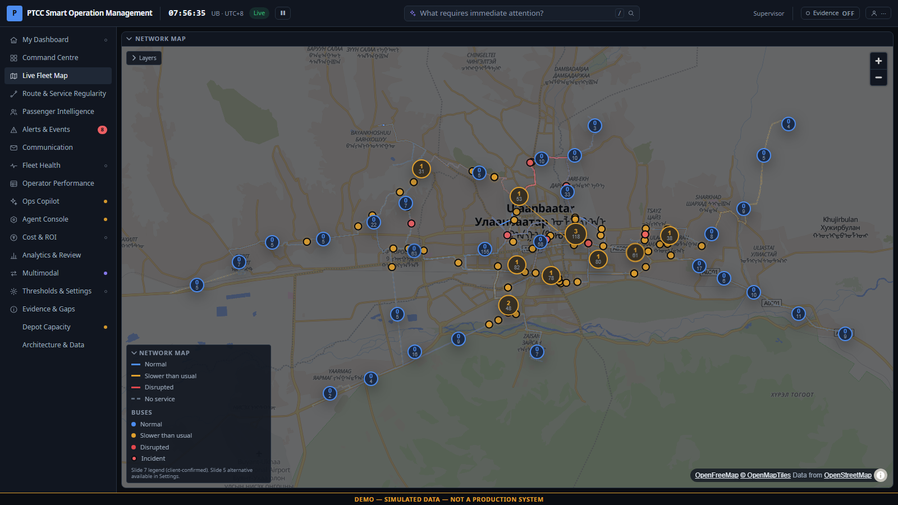
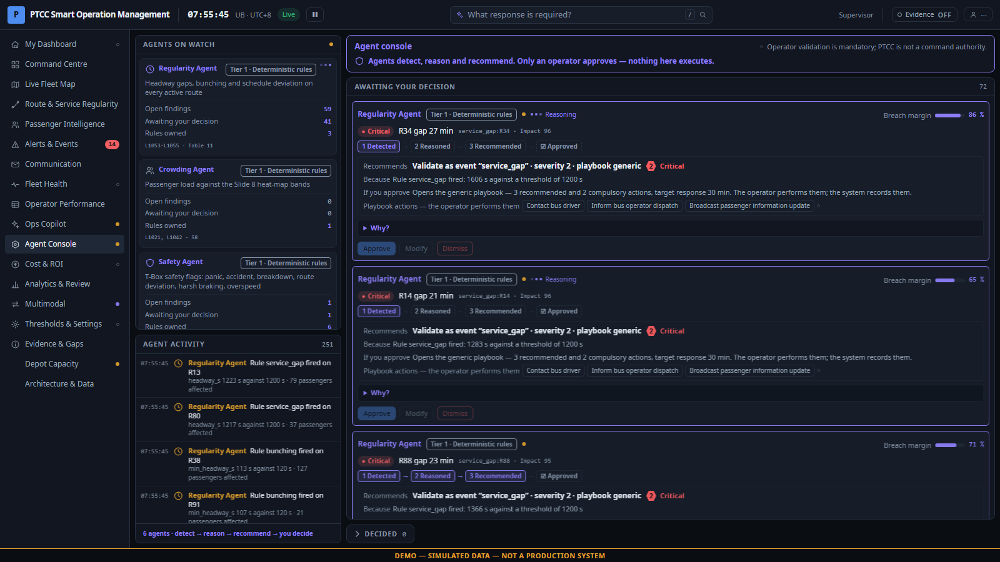
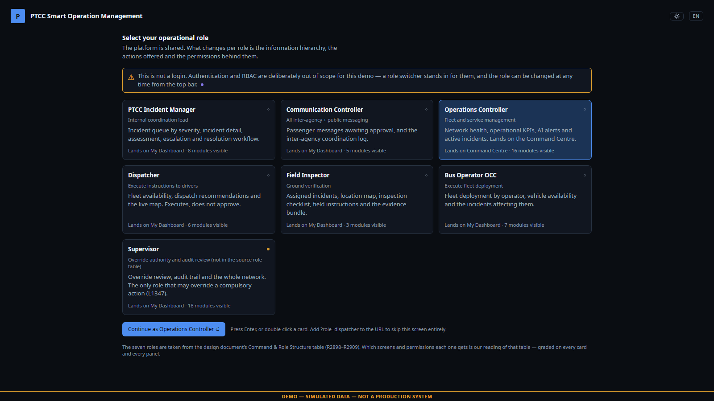
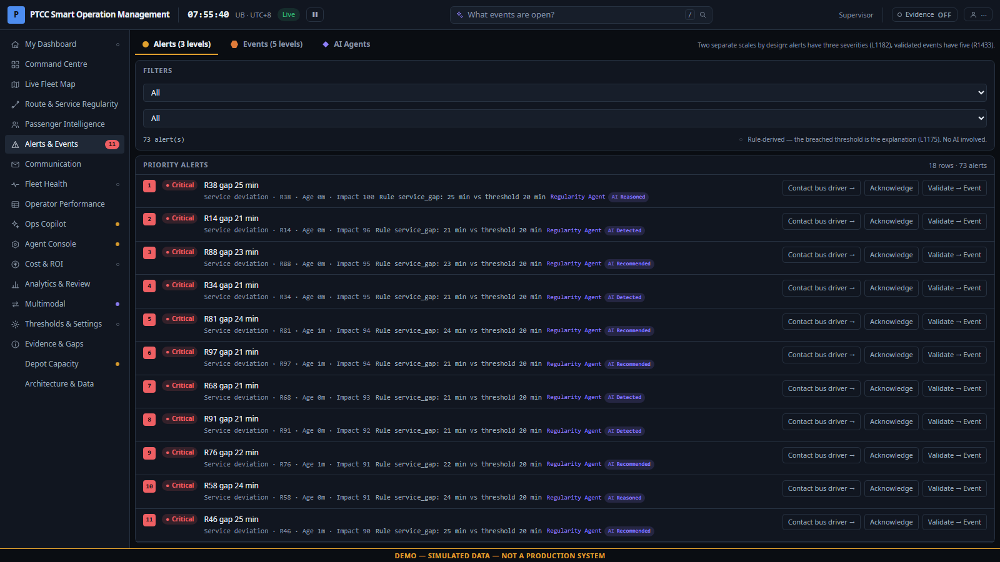

<div align="center">

# PTCC Smart Operation Management

**A role-based control-centre dashboard for the Ulaanbaatar public bus network.**

Seven operator roles · 18 modules · 1,100 simulated buses on the real road network · fully offline

[](https://react.dev)
[](https://www.typescriptlang.org)
[](https://vite.dev)
[](https://tailwindcss.com)
[](https://maplibre.org)
[](https://github.com/Charliefirewall/PTCC_RBAC_dashboard/actions/workflows/ci.yml)
[](#testing)



</div>

---

> [!IMPORTANT]
> **This is a demonstrator running on a simulated network. It is not a production system.**
> No live feed, no database, no authentication. Every figure on screen is computed by the
> in-browser simulation. The `DEMO — SIMULATED DATA` banner is always visible and cannot be
> dismissed. Where a number would need data the client does not yet hold, the screen says so
> rather than inventing it.

---

## Contents

- [What it does](#what-it-does) · [Quick start](#quick-start) · [The role model](#the-role-model)
- [Governance](#governance-the-rules-the-ui-may-not-break) · [Architecture](#architecture) · [Testing](#testing)
- [Project layout](#project-layout) · [Presenting](#presenting-the-demo) · [Deployment](docs/DEPLOYMENT.md) · [Known limits](#known-limits) · [Attribution](#attribution)

---

## What it does

A public transport control centre has one hard problem: **1,086 buses are running normally and
12 are not, and the operator must see the 12.** Every screen here is built around that.

| | |
|---|---|
| **Detect** | A deterministic rule engine watches headway, load, schedule deviation, on-board equipment and driver behaviour, and raises alerts on a 3-level scale. |
| **Triage** | Alerts rank by *impact* — severity multiplied by the passengers actually affected — not by arrival time. |
| **Validate** | An alert is only ever a proposal. An operator confirms it against a four-point checklist before it becomes an event. |
| **Respond** | Each event type opens its playbook: recommended actions, compulsory actions, and a seven-stage workflow that cannot skip a gate. |
| **Quantify** | Cost & ROI converts avoided incidents into ₮, with every assumption editable live in front of the client. |

<table>
<tr>
<td width="50%"><br><em>Live Fleet Map — buses routed on the real street network, markers rotated to their direction of travel</em></td>
<td width="50%"><br><em>Agent Console — six agents detect, reason and recommend; a human decides</em></td>
</tr>
</table>

### The agent layer, and where it stops

Six agents (Regularity, Equipment, Safety, Pattern, Demand, Response) run a
**detect → context → reason → evidence → recommend** cycle and then stop. Their decision
clock ends at `recommended` and never walks past it on its own. No agent decision object
carries a callable anywhere in the codebase — autonomous action is not *representable*, not
merely disabled. That boundary is pinned by test, not by convention.

---

## Quick start

```bash
npm install
npm run tiles      # one-off: downloads the offline basemap (~21 MB, ~2 min)
npm run dev        # http://localhost:5173
```

For the demo itself use the production build — it is the artefact that goes in the room:

```bash
npm run preview    # builds, then serves on http://127.0.0.1:4173
```

Or run the container, which needs no Node toolchain and fetches its own map pack:

```bash
docker compose up -d --build   # → http://localhost:8080
```

A 68.8 MB self-contained image: application, basemap, glyphs and sprite, served by nginx as
a non-root user with a read-only root filesystem and **no runtime network access at all**.
See [`docs/DEPLOYMENT.md`](docs/DEPLOYMENT.md).

> [!TIP]
> **Turn your network off and reload.** The whole application keeps working: the basemap,
> the fonts, the glyphs and the icon sprite are all served from `public/`. This is verified
> by a regression test that fails if a single off-origin request appears. A control room
> should not go dark because a CDN did.

### Scripts

| Command | What it does |
|---|---|
| `npm run dev` | Vite dev server with HMR |
| `npm run build` | Type-check and bundle to `dist/` |
| `npm run preview` | Build, then serve the production bundle on `:4173` |
| `npm run tiles` | Fetch the offline basemap pack into `public/` |
| `npm test` | Vitest — 147 unit tests |
| `npm run verify` | Integration, journey and per-role interaction suites (needs `:4173`) |
| `npm run audit` | Full UI audit: 4 widths × 2 themes + video-wall mode |
| `npm run typecheck` | `tsc -b`, no emit |
| `docker compose up -d --build` | Build and run the production container on `:8080` |

Every browser suite honours a `PTCC_BASE` override, so the same checks can be pointed at a
container or a real deployment: `PTCC_BASE=https://ptcc.example.com npm run verify`.

---

## The role model

The nav, the landing screen, the widget composition and the permissions all read from **one
table** — [`src/modules/roles/roles.ts`](src/modules/roles/roles.ts). Change a role there and
every screen agrees with the change.



| Role | Function | Lands on | Holds |
|---|---|---|---|
| **PTCC Incident Manager** | Internal coordination lead | Dashboard | 6 of 11 permissions |
| **Communication Controller** | All inter-agency + public messaging | Dashboard | 3 — including `approve_message` |
| **Operations Controller** | Fleet and service management | Command Centre | 6 |
| **Dispatcher** | Executes instructions to drivers | Dashboard | 4 — executes, never approves |
| **Field Inspector** | Ground verification | Dashboard | 2 — `complete_action`, `upload_evidence` |
| **Bus Operator OCC** | Executes fleet deployment | Dashboard | 2 |
| **Supervisor** | Override authority | Dashboard | 11 of 11 |

Six of the seven roles and their one-line functions come verbatim from the client's design
document. **Supervisor is ours** — the document grants exactly one authority the right to
override a compulsory action, and that authority needed a holder. The code says so at the
point of definition rather than blurring the line.

### Permissions are enforced in the store, not the widget

An early version consulted `can()` only inside role-dashboard widgets — widgets already
assigned to roles that held the permission, so no check could ever fire, while the same
actions sat ungated on the Emergency Handling screen. The guard now lives in the store
mutation itself:

```ts
advance: (event_id, by) => {
  // Guard at the STORE, not the widget. One early-return here is smaller than
  // 13 call sites and cannot be bypassed by a second caller.
  if (!can(useSettings.getState().role, 'advance_stage')) return { ok: false, blocked: [] };
  ...
}
```

Skip to [`src/store/index.ts`](src/store/index.ts) for `advance`, `completeAction`, `approve`,
`sendCoordination` and `override`.

---

## Governance: the rules the UI may not break

These are not UX preferences. Each one traces to a specific line in the client's design
document, is enforced in the store, and is pinned by a test that was verified to fail without it.



| Rule | What it means in the product |
|---|---|
| **PTCC is not a command authority** | The system recommends and coordinates. It never issues an instruction on its own. |
| **Operator validation is mandatory** | An alert becomes an event only when a human ticks all four verification checks. `Confirm` stays disabled until then. |
| **Compulsory actions gate progression** | A stage will not advance while a compulsory action for that gate is outstanding — the refusal is loud and each blocker is clearable in place. |
| **Supervisor-only override** | Only the Supervisor may override a compulsory action, it demands a written justification, and it is written to the audit trail with the *actual* actor. |
| **Two scales never merge** | The 3-level alert scale and the 5-level event scale live on separate tabs and are never rendered as one ladder. |

> [!NOTE]
> The audit trail records the acting role from live state. An earlier version hard-coded
> `role: 'supervisor'` into the override audit row — a non-supervisor override would have been
> *recorded as* a supervisor's. An audit log that can lie about the actor is worse than no
> audit log, and that is the class of bug this section exists to prevent.

---

## Architecture

```
┌─────────────────────────────────────────────────────────────────────┐
│  UI            18 route modules · shared primitives · EN/MN         │
├─────────────────────────────────────────────────────────────────────┤
│  Stores        zustand: sim · alerts · events+audit · comms ·       │
│  (one set      agentic · selection · overlay · settings             │
│   per tick)    ── permission guards live here ──                    │
├─────────────────────────────────────────────────────────────────────┤
│  Rules         deterministic thresholds → 3-level alerts            │
│                playbooks · compulsory-action gates · severity map   │
├─────────────────────────────────────────────────────────────────────┤
│  Agents        detect → context → reason → evidence → recommend     │
│                (stops there, by construction)                       │
├─────────────────────────────────────────────────────────────────────┤
│  Simulation    1,100 vehicles · road-network routing · car-following│
│                seeded PRNG, zero Math.random, fully reproducible    │
└─────────────────────────────────────────────────────────────────────┘
```

**Vehicle positions deliberately do not live in React state.** The map reads them from the
engine each frame at ~18 Hz, above a discrete ~394 ms simulation tick, with sub-tick
interpolation so motion is smooth without the engine ever being asked to lie about where a
bus is. See [`docs/ARCHITECTURE.md`](docs/ARCHITECTURE.md) for the simulation model, the road
graph, the offline basemap and the design-token system.

### Determinism

The same seed produces the same shift, every time — a demo you can rehearse. Five independent
`mulberry32` streams, FNV-1a seeded; `Math.random` appears nowhere in `src/`. Override with
`?seed=`, and step the nine scripted scenarios with number keys `1`–`9` (`N` advances a step,
`0` resets).

---

## Testing

Three layers, because they fail in different ways. All figures below are from the current
`main`; nothing is listed here that has not actually been run.

| Suite | Checks | What it would catch |
|---|---|---|
| `npm test` | **147** unit | Simulation physics, rule thresholds, agent-autonomy boundary, i18n integrity, permission guards |
| `tools/integration-verify.mjs` | **49** | Every route in both themes renders with zero console errors |
| `tools/journey-e2e.mjs` | **16** | The presenter's path, end to end |
| `tools/role-journey.mjs` | **35** | Every role's *primary action*, all nine scenarios, both directions of the override rule |
| `tools/uiaudit.spec.ts` | **6** | Overlap, clipping and contrast at 4 widths × 2 themes + video wall |
| `tools/role-sweep.mts` | **63** screens | Every role × every screen it can reach: crashes, empty panels, clipped strings |
| `tools/map-offline-check.mjs` | **8** | Zero off-origin requests; the offline guarantee |
| `tools/soak.mjs` | 14 min | Heap growth, DOM growth, tick-rate drift over a realistic demo length |

**Soak result:** heap flat at 45 MB across 14 minutes, ~144 ticks/min steady, zero errors.

**CI runs type-check, unit tests, the production build, and a Docker build that starts the
container and asserts it actually serves the app — index.html, security headers, a vector
tile with the right MIME type, and the Cyrillic glyph range.** The browser
suites are deliberately not in CI — they need the offline tile pack, which is fetched from
OpenFreeMap rather than committed, and re-downloading a third-party database on every push
is neither polite nor fast. Run them locally: `npm run preview`, then `npm run verify`.

> [!NOTE]
> Every fix in this repository is pinned by a check that was **verified to fail without it** —
> the test is disabled, the failure observed, the fix restored. Several checks in this suite
> were initially passing or failing for the wrong reason and were rewritten once that was
> found; [`docs/TESTING.md`](docs/TESTING.md) names them, because a test that passes for the
> wrong reason is worse than no test.

---

## Project layout

```
src/
  app/          Shell, nav, routing, hotkeys, overlay host, error boundary
  modules/      18 route modules — command, map, alerts, roi, health, agentic, roles, …
  components/   Panel, DataTable, KpiTile, Stepper, Callout, Empty, form primitives
  store/        zustand stores, engine bridge, permission guards, shift seed
  sim/          Deterministic engine: motion, physics, scenarios, types
  rules/        Thresholds, rule evaluation, playbooks, compulsory-action gates
  agent/        The six agents and their reasoning traces
  map/          MapLibre layers: clusters, markers, popups, risk colouring
  data/         Network build + the extracted road graph
  i18n/         Bilingual dictionaries (EN/MN), split by area
  styles/       Design tokens — spacing, radius, motion, elevation, type scale
tools/          39 verification, audit and build scripts
docs/           Architecture and testing notes
```

---

## Presenting the demo

| Key | Action |
|---|---|
| `1`–`9` | Load scenario D1–D9 |
| `N` / `0` | Next step / reset the network |
| `W` | Video-wall mode (2.2× type scale, read at 3–8 m) |
| `E` | Evidence mode — every panel reveals its provenance grade and citation |
| `/` | Focus the ask bar |

Append `?role=supervisor` to skip the role-selection screen, `&lang=mn` for Mongolian,
`&theme=light` for the light palette.

**Evidence mode is the honesty switch.** Every figure is graded `CONFIRMED` (traceable to the
client's document), `INFERRED` (derived from it), `ASSUMPTION` (ours, and labelled) or
`FUTURE`. Turn it on and the provenance of the whole screen becomes visible — including the
places where the answer is "we do not have this data".

---

## Known limits

Named deliberately. This section is the point of the honesty stance above.

- **Mongolian is machine-quality.** 1,245 of 1,426 strings are unreviewed. The `r: true` flag
  in the dictionaries marks the 181 that a native speaker has confirmed.
- **Three of 48 corridor pairs** fall back to a straight line across the Tuul river — the
  bundled tiles contain no connected crossing at those zoom levels.
- **Two strings clip at 1024 px.** Clean at 1280 and above; the demo is designed for ≥1280.
- **Bus Operator OCC is read-only** — its dashboard reports but offers no action control.
- **No real data connector, no authentication.** Both are FUTURE items, not oversights. Role
  selection is a demo convenience, not a security boundary — every role is reachable by URL,
  and the app says so on screen. Put the container behind your own auth before exposing it.
- The predictive model is a **deterministic duty-cycle model, not machine learning.** It has
  no trained parameters and was fitted to nothing, because there is no maintenance history to
  fit it to. Confidence is capped at 60 % and the screen says why.

---

## Attribution

Basemap tiles, glyphs and sprites from **[OpenFreeMap](https://openfreemap.org)**, built from
**[OpenStreetMap](https://www.openstreetmap.org/copyright)** data, © OpenStreetMap
contributors, licensed under the **[ODbL](https://opendatacommons.org/licenses/odbl/)**.
Attribution is displayed on every map in the application.

These assets are **not committed to this repository** — they are a third-party database, and
`npm run tiles` reproduces the pack from source. If this demo is ever redistributed with the
tile pack included, confirm the ODbL share-alike obligations first.

Icons are a hand-built SVG sprite. Charts use [Apache ECharts](https://echarts.apache.org).
